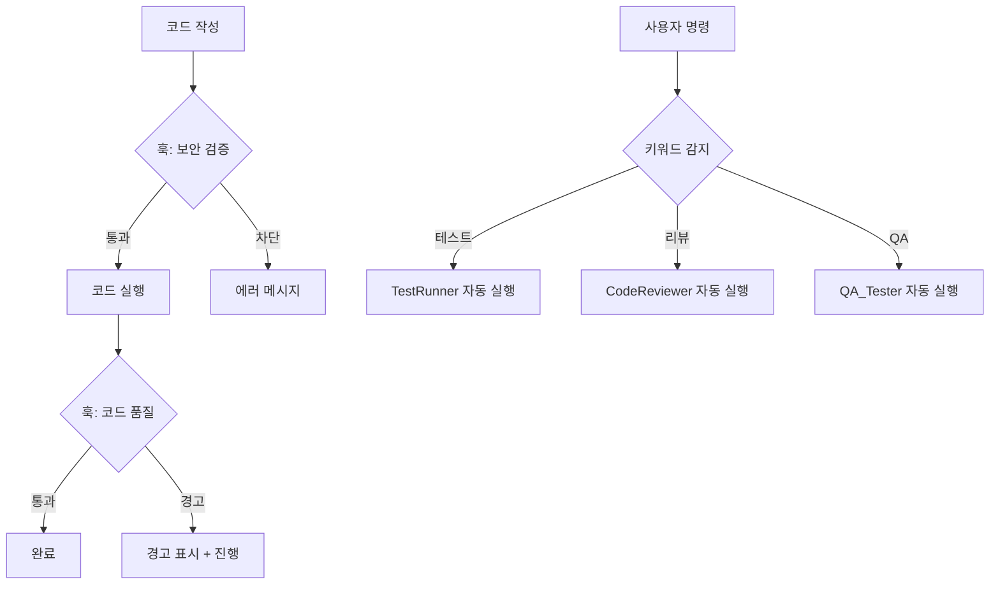

# Phoenix Trading 자동화 시스템 사용 가이드

**작성일:** 2026-01-23
**버전:** 1.0
**대상:** Phoenix Trading 프로젝트 개발자/운영자

---

## 목차
1. [시스템 개요](#시스템-개요)
2. [빠른 시작](#빠른-시작)
3. [스킬 사용법](#스킬-사용법)
4. [서브에이전트 사용법](#서브에이전트-사용법)
5. [MCP 플러그인 사용법](#mcp-플러그인-사용법)
6. [훅 사용법](#훅-사용법)
7. [일일 워크플로우](#일일-워크플로우)
8. [문제 해결](#문제-해결)

---

## 시스템 개요

### 구성 요소

```
.claude/
├── skills/               # 재사용 가능한 명령어
│   ├── excel-check/      # Excel 검증
│   └── kis-health/       # KIS API 헬스체크
├── agents/               # 자동화 에이전트
│   ├── TestRunner.md     # 테스트 실행
│   ├── CodeReviewer.md   # 코드 리뷰
│   └── QA_Tester.md      # 통합 테스트
├── mcp-servers/          # MCP 플러그인
│   └── kis_api_validator.py  # KIS API 검증
├── hooks/                # 자동 검증 훅
│   ├── security-check.sh      # 보안 검증
│   └── code-quality-check.sh  # 코드 품질
├── scripts/              # 유틸리티 스크립트
│   ├── excel_validator.py
│   └── kis_health_check.py
└── logs/                 # 리포트 저장소
```

### 자동화 흐름



---

## 빠른 시작

### 1. 의존성 설치 (선택)

훅의 코드 품질 검사 기능을 사용하려면:

```bash
pip install flake8 mypy bandit
```

### 2. 첫 번째 스킬 실행

```bash
# Excel 파일 검증
excel-check
# 또는
/excel-check
```

출력 예시:
```
============================================================
Phoenix Trading Excel 템플릿 검증 시작
============================================================
...
✅ 모든 검증 통과!
📄 리포트 저장됨: .claude/logs/Excel-Validation-Report.md
```

### 3. KIS API 헬스체크

```bash
kis-health
```

### 4. 테스트 실행 (에이전트 자동 트리거)

```
테스트 돌려줘
```

→ TestRunner 에이전트가 자동으로 pytest 실행 + 분석 리포트 생성

---

## 스킬 사용법

### Excel 검증 스킬

**파일:** `.claude/skills/excel-check/SKILL.md`

#### 사용 시나리오
- Excel 파일 수정 후 검증
- 실거래 전 설정 확인
- CI/CD 파이프라인에 통합

#### 사용법
```bash
# 방법 1: 스킬 이름으로 호출
excel-check

# 방법 2: 직접 스크립트 실행
python .claude/scripts/excel_validator.py phoenix_grid_template_v3.xlsx
```

#### 검증 항목
- ✅ B12: KIS APP KEY
- ✅ B13: KIS APP SECRET
- ✅ B14: 계좌번호
- ✅ B15: 시스템 가동
- ✅ B16-B20: Tier 매도가
- ✅ B22: Tier 1 매수%

#### 리포트 위치
`.claude/logs/Excel-Validation-Report.md`

---

### KIS API 헬스체크 스킬

**파일:** `.claude/skills/kis-health/SKILL.md`

#### 사용 시나리오
- 매일 거래 시작 전 API 연결 확인
- 토큰 만료 시 재발급 확인
- API 장애 모니터링

#### 사용법
```bash
kis-health
```

#### 검증 항목
1. Excel 설정 로드
2. API 서버 연결
3. 토큰 발급
4. 계좌 조회

#### 성공 조건
```
✅ 모든 검증 통과! KIS API 연결 정상

🚀 다음 단계:
   1. Excel B15를 TRUE로 변경 (시스템 가동)
   2. phoenix_main.py 실행
```

---

## 서브에이전트 사용법

### 자동 트리거 방식

서브에이전트는 **키워드를 감지**하면 자동으로 활성화됩니다.

#### TestRunner 에이전트

**트리거 키워드:** `test`, `pytest`, `coverage`, `테스트`

**예시:**
```
사용자: 테스트 돌려줘
→ TestRunner 자동 활성화

사용자: pytest coverage 확인
→ TestRunner 자동 활성화 + 커버리지 분석
```

**출력:**
```markdown
# Test Report 2026-01-23

## 결과
✅ 성공: 15개
❌ 실패: 2개

## 커버리지
- src/kis_rest_adapter.py: 85%
- src/grid_engine.py: 92%
```

---

#### CodeReviewer 에이전트

**트리거 키워드:** `review`, `리뷰`, `코드검토`, `품질`

**예시:**
```
사용자: kis_rest_adapter.py 리뷰해줘
→ CodeReviewer 자동 활성화

사용자: 보안 검토 필요
→ CodeReviewer 자동 활성화 (보안 집중 모드)
```

**출력:**
```markdown
# Code Review Report

## 🔴 Critical
1. **API 키 노출 위험** (kis_rest_adapter.py:15)
   - 문제: 로그에 app_secret 출력
   - 해결: logger.debug("App Secret: ***")
```

---

#### QA_Tester 에이전트

**트리거 키워드:** `통합테스트`, `시나리오`, `버그`, `QA`

**예시:**
```
사용자: 통합 테스트 실행
→ QA_Tester 자동 활성화

사용자: Tier 1 돌파 시나리오 검증
→ QA_Tester 자동 활성화 (특정 시나리오 집중)
```

**시나리오:**
1. 정상 거래 플로우
2. API 장애 복구
3. Excel Lock 처리
4. 동시 주문 충돌
5. Tier 가격 오류 감지

---

## MCP 플러그인 사용법

### KIS API Validator MCP

**파일:** `.claude/mcp-servers/kis_api_validator.py`

#### 설치

```bash
# MCP 서버 추가
claude mcp add --transport stdio kis-api \
  --env API_DOC_URL="https://apiportal.koreainvestment.com" \
  -- python D:\Project\SOLX\.claude\mcp-servers\kis_api_validator.py

# 설치 확인
claude mcp list
```

#### 자동 검증 예시

```python
# 코드 작성 중...
adapter.order_stock(
    CANO="12345678",
    ACNT_PRDT_CD="01",
    OVRS_EXCG_CD="NASD",
    PDNO="SOXL",
    ORD_QTY="10",
    OVRS_ORD_UNPR="35.50",
    ORD_SVR_DVSN_CD="0",
    ORD_DVSN="32"  # 지정가 매수
)
```

→ MCP가 자동으로 파라미터 검증:
- ✅ 모든 필수 파라미터 존재
- ✅ 타입 일치
- ✅ Enum 값 유효
- ⚠️ 불필요한 파라미터 경고

#### 수동 검증

```bash
# API 문서 조회
echo '{"jsonrpc":"2.0","method":"get_api_doc","params":{"api_name":"order_stock"},"id":1}' \
  | python .claude/mcp-servers/kis_api_validator.py
```

---

## 훅 사용법

### 보안 검증 훅 (PreToolUse)

**파일:** `.claude/hooks/security-check.sh`

#### 활성화 방법

`.claude/settings.local.json`에 추가:

```json
{
  "hooks": {
    "PreToolUse": [
      {
        "matcher": "Bash",
        "hooks": [
          {
            "type": "command",
            "command": "bash ./.claude/hooks/security-check.sh \"${ARGUMENTS}\"",
            "timeout": 5000
          }
        ]
      }
    ]
  }
}
```

#### 동작 예시

```bash
# 위험한 명령 차단
rm -rf /

→ ❌ [보안 훅] 위험한 명령이 감지되었습니다!
   패턴: rm -rf /
   명령: rm -rf /
   (실행 차단됨)
```

#### 검사 항목
- ✅ 위험한 명령 (rm -rf, DROP TABLE)
- ✅ Fork bomb
- ⚠️ 실거래 명령 (경고만)
- ⚠️ API 키 노출

---

### 코드 품질 훅 (PostToolUse)

**파일:** `.claude/hooks/code-quality-check.sh`

#### 활성화 방법

`.claude/settings.local.json`에 추가:

```json
{
  "hooks": {
    "PostToolUse": [
      {
        "matcher": "Write|Edit",
        "hooks": [
          {
            "type": "command",
            "command": "bash ./.claude/hooks/code-quality-check.sh \"${FILE_PATH}\"",
            "timeout": 10000
          }
        ]
      }
    ]
  }
}
```

#### 동작 예시

Python 파일 수정 시 자동 실행:

```
🔍 [코드 품질 훅] 검사 중: src/kis_rest_adapter.py
   - PEP 8 스타일 검사...
   ✅ PEP 8 통과
   - 타입 힌트 검사...
   ⚠️  타입 경고 발견
   - 보안 취약점 검사...
   ✅ 보안 검사 통과
```

#### 검사 항목
- PEP 8 스타일 (flake8)
- 타입 힌트 (mypy)
- 보안 취약점 (bandit)
- 하드코딩된 API 키
- TODO/FIXME 주석
- print() 디버그 코드

---

## 일일 워크플로우

### 거래 시작 전

```bash
# 1. Excel 검증
excel-check

# 2. KIS API 헬스체크
kis-health

# 3. 코드 변경사항 리뷰 (선택)
코드 리뷰해줘

# 4. 테스트 실행
테스트 돌려줘
```

### 코드 변경 시

```bash
# 1. 코드 작성
# (자동으로 코드 품질 훅 실행)

# 2. 단위 테스트
pytest tests/test_specific.py

# 3. 통합 테스트
통합 테스트 실행

# 4. 커밋
git add .
git commit -m "feat: ..."
```

### 거래 종료 후

```bash
# 1. 로그 확인
ls -la logs/

# 2. 리포트 검토
cat .claude/logs/Test-Report-*.md

# 3. 다음 날 개선사항 정리
```

---

## 문제 해결

### Q1: 스킬이 인식되지 않음

**증상:**
```
excel-check
→ Command not found
```

**해결:**
1. 스킬 파일 위치 확인:
   ```bash
   ls -la .claude/skills/excel-check/SKILL.md
   ```

2. 파일명 확인: `SKILL.md` (대문자)

3. YAML 헤더 확인:
   ```yaml
   ---
   name: excel-check
   user-invocable: true
   ---
   ```

---

### Q2: 에이전트가 자동 트리거되지 않음

**증상:**
```
사용자: 테스트 돌려줘
→ TestRunner 실행 안 됨
```

**해결:**
1. 에이전트 파일 확인:
   ```bash
   cat .claude/agents/TestRunner.md
   ```

2. `trigger` 키워드 확인:
   ```yaml
   trigger: "test|pytest|coverage|테스트"
   ```

3. `permission-mode` 확인:
   ```yaml
   permission-mode: auto
   ```

---

### Q3: 훅이 실행되지 않음

**증상:**
```
rm -rf /
→ 보안 훅 경고 없이 실행 시도
```

**해결:**
1. 설정 파일 확인:
   ```bash
   cat .claude/settings.local.json
   ```

2. 훅 경로 확인:
   ```json
   "command": "bash ./.claude/hooks/security-check.sh"
   ```

3. 훅 실행 권한:
   ```bash
   chmod +x .claude/hooks/*.sh
   ```

4. 수동 테스트:
   ```bash
   bash .claude/hooks/security-check.sh "rm -rf /"
   echo $?  # 2 = 차단
   ```

---

### Q4: MCP 서버 연결 실패

**증상:**
```
claude mcp list
→ kis-api (stdio) - Failed
```

**해결:**
1. 수동 실행 테스트:
   ```bash
   python .claude/mcp-servers/kis_api_validator.py
   ```

2. Python 경로 확인:
   ```bash
   which python
   python --version
   ```

3. MCP 재등록:
   ```bash
   claude mcp remove kis-api
   claude mcp add --transport stdio kis-api \
     -- python D:\Project\SOLX\.claude\mcp-servers\kis_api_validator.py
   ```

---

## 다음 단계

### 추가 스킬 개발
- `/daily-report`: 일일 거래 리포트 생성
- `/backup-excel`: Excel 파일 자동 백업
- `/analyze-logs`: 로그 분석

### 에이전트 확장
- `SecurityAuditor`: 보안 전문 감사
- `PerformanceOptimizer`: 성능 최적화 제안
- `DocumentGenerator`: 자동 문서화

### MCP 통합
- GitHub API: PR 자동 생성
- Slack API: 거래 알림
- Sentry API: 에러 모니터링

---

## 참고 문서

- [Claude Code 공식 문서](https://docs.anthropic.com/claude-code)
- [MCP 프로토콜](https://modelcontextprotocol.io/)
- [Python Best Practices](https://peps.python.org/pep-0008/)
- [Phoenix Trading 프로젝트 README](../README.md)

---

**작성:** Claude Code Automation System
**버전:** 1.0
**최종 업데이트:** 2026-01-23
