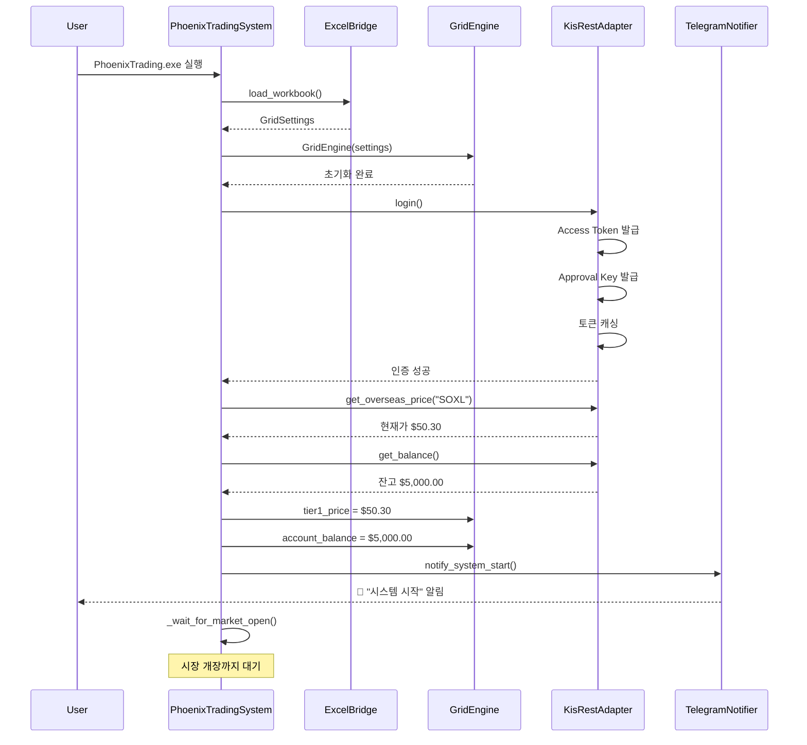
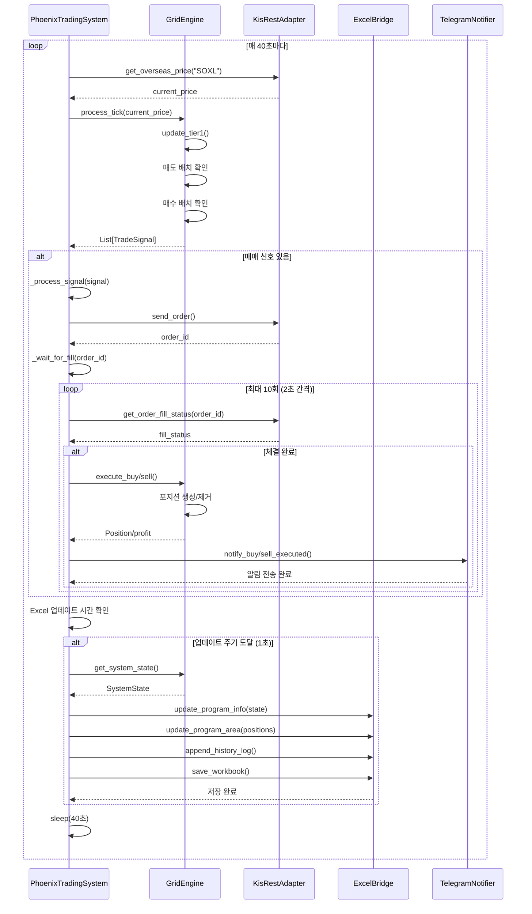
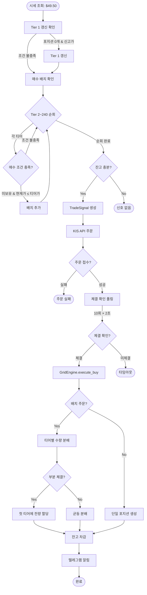
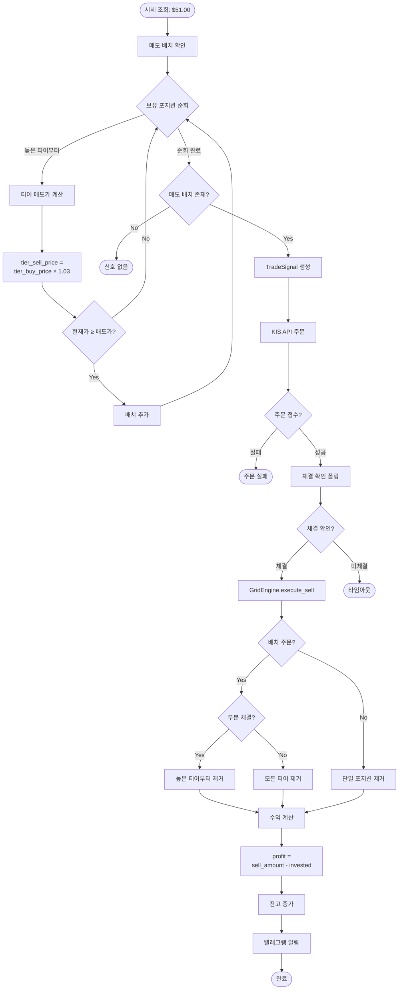
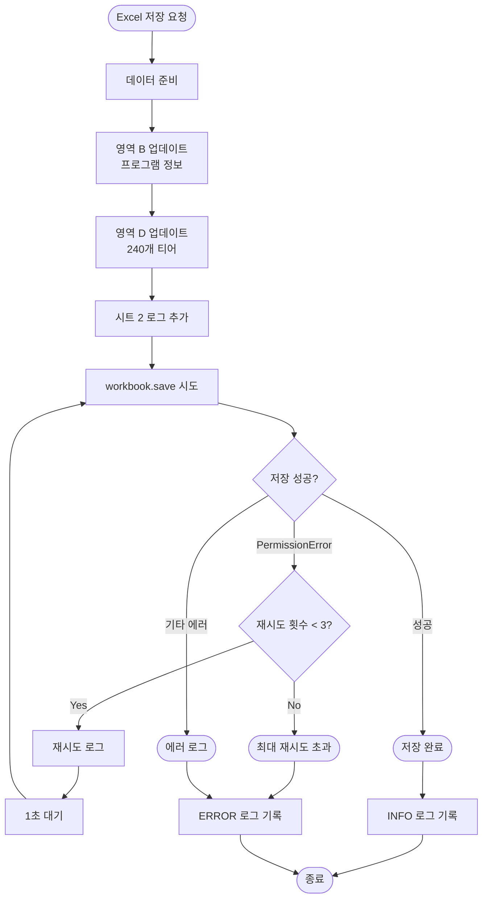
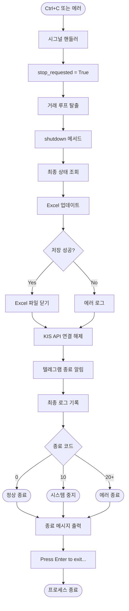
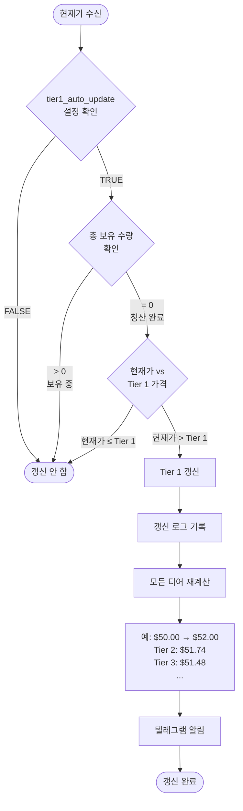
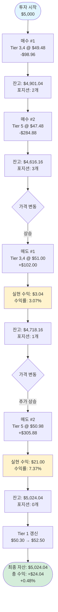

# Phoenix Trading System - 타임라인 다이어그램

**작성일**: 2026-01-24
**버전**: v4.1
**목적**: 시스템 동작 흐름 시각화

---

## 1. 시스템 초기화 시퀀스



---

## 2. 거래 루프 (단일 사이클)



---

## 3. 매수 주문 플로우



---

## 4. 매도 주문 플로우



---

## 5. 에러 처리 플로우

```mermaid
flowchart TD
    Start([API 호출]) --> RateLimit[Rate Limiting]
    RateLimit --> CheckInterval{200ms 경과?}
    CheckInterval --> |No| Sleep[sleep 대기]
    CheckInterval --> |Yes| TokenCheck[토큰 만료 확인]
    Sleep --> TokenCheck

    TokenCheck --> IsExpired{만료 5분 전?}
    IsExpired --> |Yes| RefreshToken[토큰 재발급]
    IsExpired --> |No| MakeRequest[HTTP 요청]
    RefreshToken --> MakeRequest

    MakeRequest --> Response{응답 상태}

    Response --> |200 OK| ParseJSON[JSON 파싱]
    Response --> |401 Unauthorized| AuthError[인증 에러]
    Response --> |Timeout| NetworkError[네트워크 에러]
    Response --> |500 Server Error| ServerError[서버 에러]

    ParseJSON --> CheckCode{rt_cd == "0"?}
    CheckCode --> |Yes| Success([성공])
    CheckCode --> |No| APIError[API 에러]

    AuthError --> Login[login 재시도]
    Login --> LoginSuccess{성공?}
    LoginSuccess --> |Yes| MakeRequest
    LoginSuccess --> |No| FatalError([치명적 에러])

    NetworkError --> Retry{재시도 가능?}
    Retry --> |Yes, 1회| Sleep5[5초 대기]
    Retry --> |No| Warning([경고 로그])
    Sleep5 --> MakeRequest

    ServerError --> Warning
    APIError --> Warning
    Warning --> Continue([다음 루프 계속])
```

---

## 6. Excel 저장 플로우



---

## 7. 시스템 종료 플로우



---

## 8. Tier 1 갱신 결정 트리



---

## 9. 거래 시간 관리

```mermaid
gantt
    title Phoenix Trading System - 24시간 운영 사이클
    dateFormat HH:mm
    axisFormat %H:%M

    section 한국 시간
    장 마감 (대기)     :done,    wait1, 06:00, 17h30m
    장 시작 준비       :active,  prep,  23:25, 5m
    정규장 (거래)      :crit,    trade, 23:30, 6h30m
    장 마감 (대기)     :done,    wait2, 06:00, 0m

    section 미국 시간
    금요일 마감        :done,    us_close, 16:00, 0m
    주말 (휴장)        :         weekend,  16:00, 65h30m
    월요일 개장        :crit,    us_open,  09:30, 0m
    정규장             :crit,    us_trade, 09:30, 6h30m
```



---

## 10. 배치 주문 vs 개별 주문 비교

```mermaid
flowchart LR
    subgraph 기존 방식 [개별 주문 방식]
        A1[시세 조회 #1<br/>$48.00] --> B1[Tier 5 매수]
        B1 --> C1[KIS API 호출]
        C1 --> D1[40초 대기]
        D1 --> A2[시세 조회 #2<br/>$47.90]
        A2 --> B2[Tier 6 매수]
        B2 --> C2[KIS API 호출]
        C2 --> D2[40초 대기]
        D2 --> A3[시세 조회 #3<br/>$47.85]
        A3 --> B3[Tier 7 매수]
        B3 --> C3[KIS API 호출]
    end

    subgraph 배치 방식 [배치 주문 방식]
        X1[시세 조회 #1<br/>$48.00] --> Y1[Tier 5,6,7<br/>동시 매수]
        Y1 --> Z1[KIS API 호출 1회]
        Z1 --> W1[40초 대기]
        W1 --> X2[다음 시세 조회]
    end

    기존 방식 -.->|슬리피지 위험| Risk[가격 변동 노출<br/>$48.00 → $47.85]
    배치 방식 -.->|가격 일관성| Safe[동일 가격 보장<br/>$48.00 × 3]
```

---

## 11. 체결 확인 폴링 타임라인

```mermaid
gantt
    title 체결 확인 프로세스 (최대 20초)
    dateFormat ss
    axisFormat %S초

    section 주문
    주문 전송          :milestone, m1, 00, 0s

    section 체결 확인
    시도 #1 (0초)      :done,    c1, 00, 2s
    시도 #2 (2초)      :done,    c2, 02, 2s
    시도 #3 (4초)      :done,    c3, 04, 2s
    시도 #4 (6초)      :active,  c4, 06, 2s
    시도 #5 (8초)      :         c5, 08, 2s
    시도 #6 (10초)     :         c6, 10, 2s
    시도 #7 (12초)     :         c7, 12, 2s
    시도 #8 (14초)     :         c8, 14, 2s
    시도 #9 (16초)     :         c9, 16, 2s
    시도 #10 (18초)    :         c10, 18, 2s

    section 결과
    체결 완료          :milestone, m2, 06, 0s
    포지션 생성        :crit,    pos, 06, 1s
```



---

## 12. 수익 실현 전체 플로우



---

**문서 작성**: AI Agent (Claude Code)
**다이어그램 도구**: Mermaid
**최종 수정**: 2026-01-24

